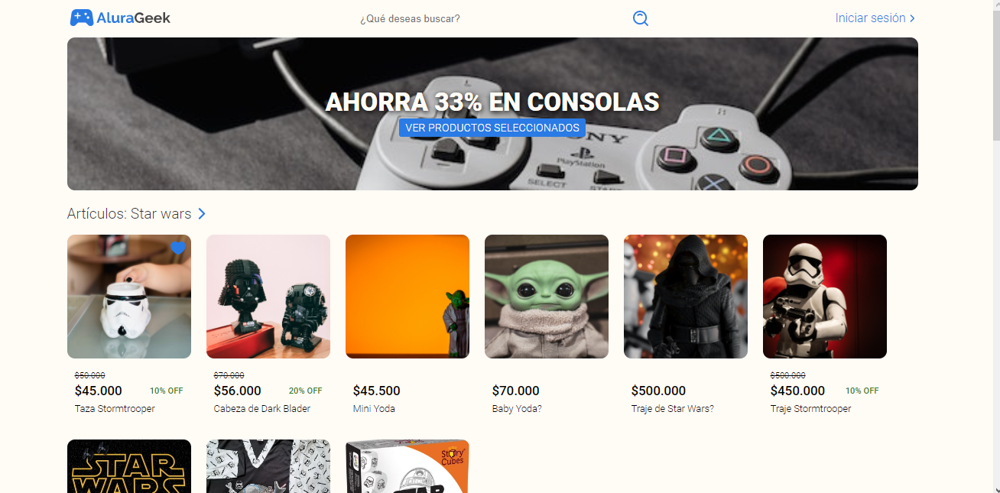
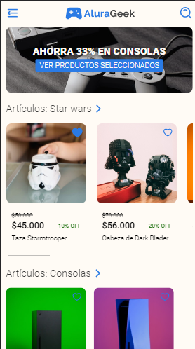

# eCommerce AluraGeek (Tienda Virtual - AluraGeek)

Esta es una solución para el challenge del proyecto [One Oracle](https://www.oracle.com/co/education/oracle-next-education/) + [Alura Latam](https://www.aluracursos.com). Estos retos nos ayudan a mejorar las habilidades de codificación mediante la creación de proyectos realistas.
No te olvides de darle una estrella, si te gustó el proyecto. 

## Tabla de contenido

- [Overview](#overview)
  - [The challenge](#the-challenge)
  - [Screenshot](#screenshot)
  - [Links](#links)
- [Mi proceso](#my-process)
  - [Construido con:](#built-with)
- [Autor](#author)

## Overview

### The challenge

La empresa AluraGeek necesita llegar a más clientes y aumentar su nivel de ventas, por lo que quieren implementar un e-commerce, llevar a la empresa al siguiente nivel y volverse más digital.

Para ello están pidiendo nuestra ayuda como desarrolladores, el e-commerce debe contener los siguientes requisitos:
- Una página de inicio que contiene un botón de inicio de sesión y un motor de búsqueda de productos ofrecidos por la empresa.
- Un banner que contenga descuentos, promociones o informaciónes relevante del momento.
- Una galería con información del producto, como imagen, nombre del producto, precio y un enlace a la página de descripción del producto.
- Una página de producto que contiene la imagen, el nombre, la descripción y el precio.
- Un pie de página con un formulario de contacto y otras informaciónes relevantes.
- Un formulário de iniciar sesión para autenticar a los usuarios que quieran acceder al menu administrador.
- Menú de administrador para que puedan agregar, editar, buscar o eliminar productos de la tienda.

Es muy importante que el sitio sea adaptable para que los clientes puedan comprar fácilmente a través de dispositivos móviles.

### Screenshot

### Links

- Solución URL: [Github.com](https://github.com/Yosoyteamc/AluraGeek.git)
- Sitio en VIVO URL: [Github Pages](https://yosoyteamc.github.io/AluraGeek/index.html)

## My process

### Built with

- Semantic HTML5 markup
- CSS custom properties
- Flexbox
- Mobile-first
- [SASS](https://sass-lang.com) - Para los estilos.
- [MOCK API](https://mockapi.io) - API de productos y usuarios.

## Author

- Linkedin - [Juan Mosquera](https://www.linkedin.com/in/juanmosquera98/)
- Instagram - [@yosoyteamc](https://www.instagram.com/yosoyteamc/)
- Github - [@yosoyteamc](https://github.com/Yosoyteamc)

